Hi everyone,

My post is about the capture the flag event hosted by NIT, Durgapur [here](https://ctf.nitdgplug.org/). Cheers to their team for such an awesome CTF!

Before you proceed, please keep in mind that this was a national level CTF aimed for entry level players and challenges were hence comparatively easy as compared to what we see in other international CTFs.

General flag syntax was GLUG{}.

Let’s get started with the solutions.

### **Web**

#### Inspection(25 points)

Navigating to [https://expect-glugctf.netlify.com,](https://expect-glugctf.netlify.com) a welcome message saying “YOU CAN EXPECT WHAT YOU INSPECT!” is shown.

So, i quickly reviewed the page source and found the flag commented out in the page source.

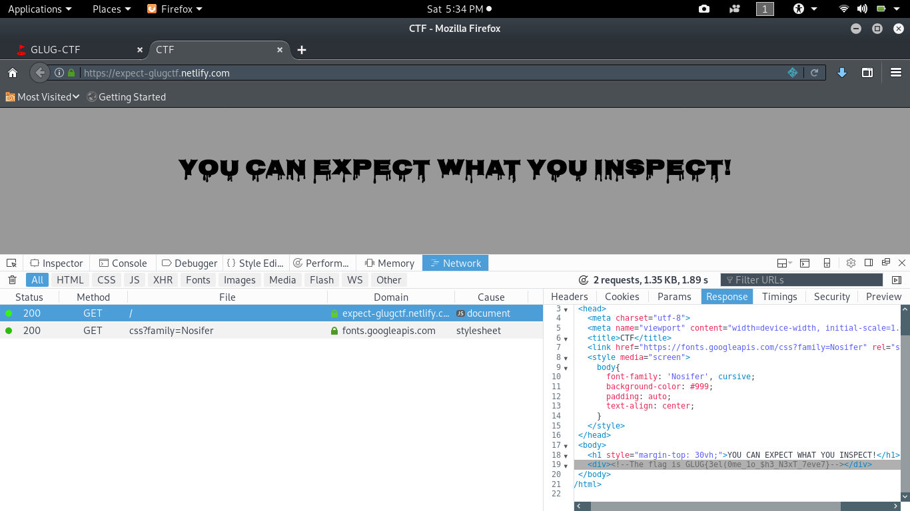

#### Go Get It! (40 points)

Navigating to the challenge link showed up a static page with a flag image and a [link](https://pastebin.com/LvfdATxz) referring to the source code.

> if(array\_key\_exists(“flag”, $\_GET))

> {

> if($\_GET\[“flag”\] === “true”) {

> echo $flag; }

> }

This function simply breaks down to, if there is a get request consisting of parameter flag with value equal to true, print the flag.

And as the challenge name suggests, we need to create a GET request with this hidden parameter to get the flag.

So, url becomes [http://104.248.49.223:7070/?flag=true](http://104.248.49.223:7070/?flag=true) which gave us the flag!

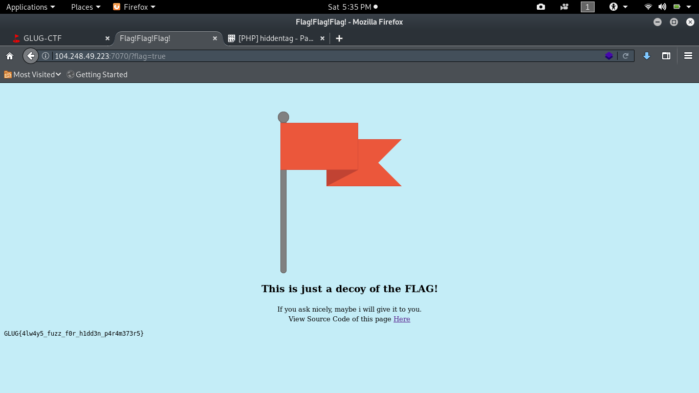

#### ROTTEN (45 points)

Heading over to the challenge link, shows a login prompt saying “Login with Flag”

Reviewing page source showed that there was a flag indeed. But we need to perform rotation13 as per the code to get the original flag!

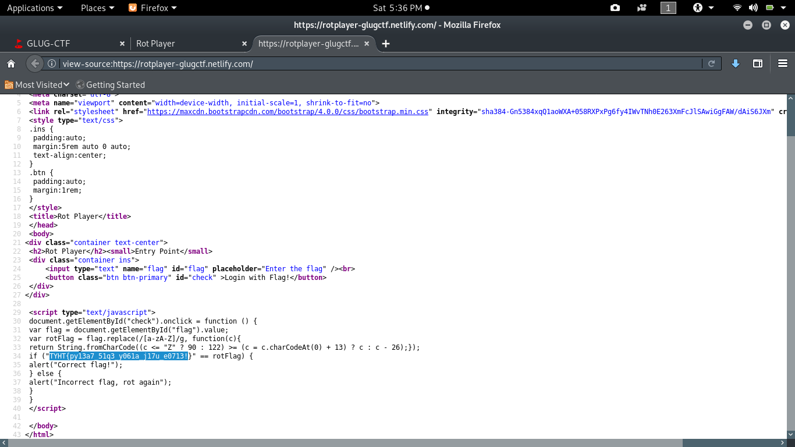

So, i quickly headed over to [https://www.rot13.com](https://rot13.com) and successfully got the flag: _GLUG{cl13n7\_51d3\_l061n\_w17h\_r0713!}_

#### The Videogame (50 points)

Browsing to the provided challenge link displays a picture of our beloved groot saying “ I am gROOT!I don’t share my videogame with anyone. The password is with only me!”

That implies in order to get the password we need to login as root user but initially there was no login panel. I turned on my burp suite and started intercepting the traffic.

Reloaded the page and intercepted the request. Turned out there was a Cookie header with value user= unknown.

Next step was to install cookie manager extension from [here](https://addons.mozilla.org/en-US/firefox/addon/a-cookie-manager/).

Changed the value of cookie from user=unknown to user=root and reloaded the page.

Our flag was right in front of our eyes.

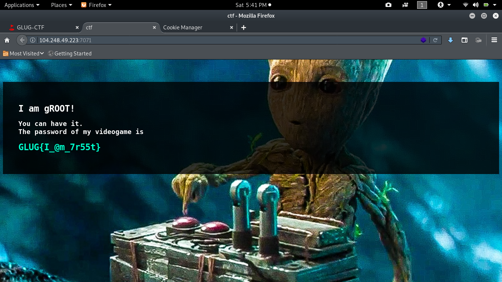

#### Referals (50 points)

The challenge page was just a static page as shown below

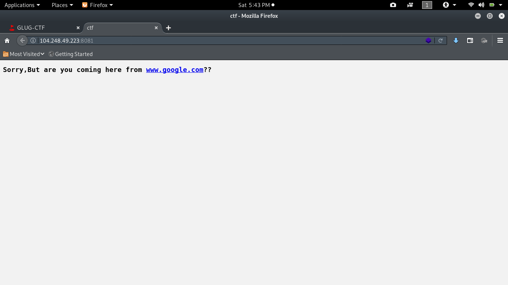

So, in order to get the access to that page we must land there from google.com.

A simple way to do that is to add a [_Referer_](https://developer.mozilla.org/en-US/docs/Web/HTTP/Headers/Referer) http header with value https://www.google.com to the request.

I intercepted the request using burp and added the Referer header. A successful response with the flag is displayed.

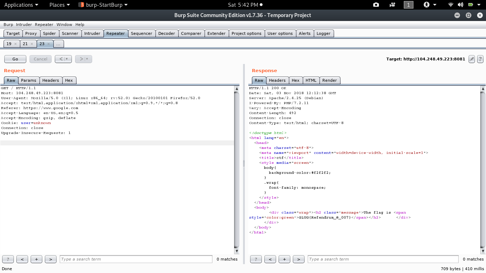

> Although, another easier way was to use curl and add the required header like “**curl -H ‘Referer:** [**https://www.google.com'**](https://www.google.com%27)  [**http://104.248.49.223:8081/**](http://104.248.49.223:8081/)**”**

#### M17 ( 50 points)

Challenge had a description saying agents are allowed and the page at challenge stated the same.

Only difference was this line :

“**Even Google is allowed to see our secrets.** You are not an agent! How dare you, to be here !!”

So, that was a direct hint that we need to see the website as google agent(google-bot) does, which leads us to robots.txt.

A few paths were disallowed, so i started checking them one by one.

One path was promising enough

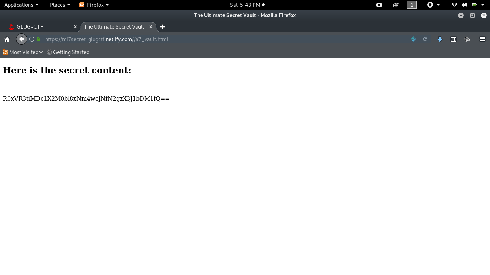

Seeing those two _equal to_ signs at end gives a hint that this is base64 encoded.

Decoding that string gives us the flag: **GLUG{b075\_c4n\_16n0r3\_7h3\_rul35}**

**For Few (70 points)**

The challenge website had some cool UI and terminal being displayed with some commands running.

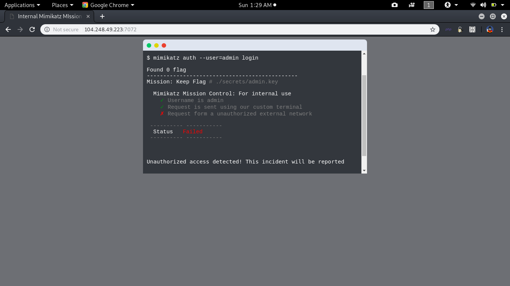

According to the page, request has to be made from internal network in order to display the flag.

I tried setting up proxy, manipulating user-agent and X-Requested-With header, changing my ip and other stuff to fool the server but none of them worked.

It was all messy until i came across [X-Forwarded-For](https://developer.mozilla.org/en-US/docs/Web/HTTP/Headers/X-Forwarded-For) http header which is a common method for identifying the originating [IP address](https://en.wikipedia.org/wiki/IP_address "IP address") of a client connecting to a [web server](https://en.wikipedia.org/wiki/Web_server "Web server") through an [HTTP](https://en.wikipedia.org/wiki/HTTP "HTTP") [proxy](https://en.wikipedia.org/wiki/Proxy_server "Proxy server") or [load balancer](https://en.wikipedia.org/wiki/Load_balancer "Load balancer"). (Thanks for help @[iamalsaher](https://twitter.com/iamalsaher) )

So, this could be used to fool the server into believing that request was indeed originated from the internal host itself. Using burp to intercept the request and adding the required header greeted us with the flag!

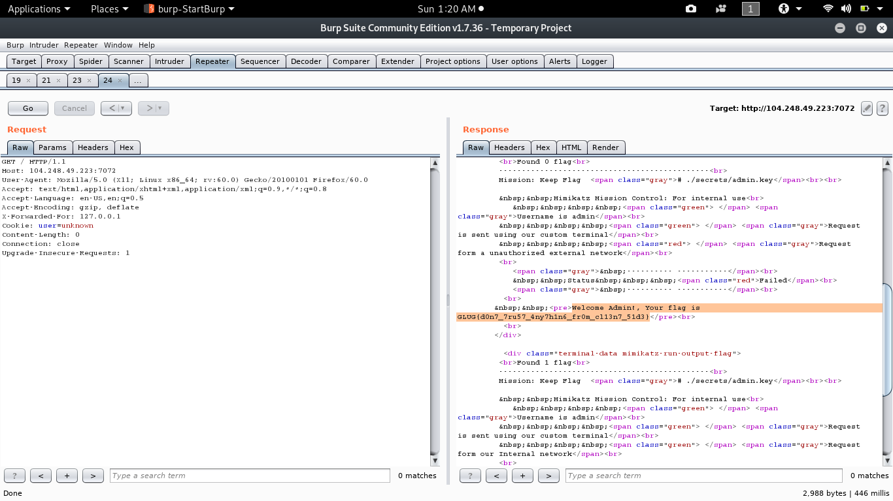

#### Musically (75 points)

The challenge page had a nice list of 254 bollywood songs with a functionality to search among the songs being displayed.

A [link](https://ghostbin.com/paste/pzzxm) to source code was available too which had following php code.

> <?php $key = “.”;

> if(array\_key\_exists(“needle”, $\_REQUEST))

> { $key = $\_REQUEST\[“needle”\]; }

> if($key != “”)

> { passthru(“grep -i $key songs.txt”); }

> ?>

The vulnerable function here is passthru which has the ability to run system commands and display raw output to the user. This could be used to achieve [**OS command injection**](https://www.owasp.org/index.php/Command_Injection).

Here, the grep command is being run when we try to search a keyword. Our goal is to run another system command and print the contents of flag.txt on server. This could be achieved by combining both commands using** ; || &&** etc.

We can input something like **“keyword;cat flag.txt”** in the search box to get the desired output.

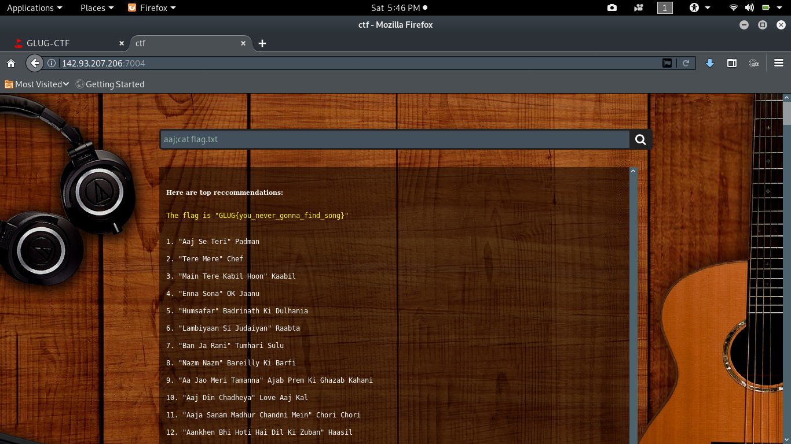

#### New Blogger (85 points)

The challenge had a hint stating flag was in /etc/flag.

Navigating to challenge shows up a blog with options to navigate to four other pages with all static content.

I tried visiting other pages to get an idea what the blog is about.

What caught my attention was the URL when i was navigating between the pages which was like [http://104.248.49.223:7074/?page=about-us.php](http://104.248.49.223:7074/?page=about-us.php)

The ?page= parameter was screaming [**Local File Inclusion**](https://www.owasp.org/index.php/Testing_for_Local_File_Inclusion) and so was the hint.

I tried changing the url to [http://104.248.49.223:7074/?page=../../../../etc/flag](http://104.248.49.223:7074/?page=../../../../etc/flag) and boom!

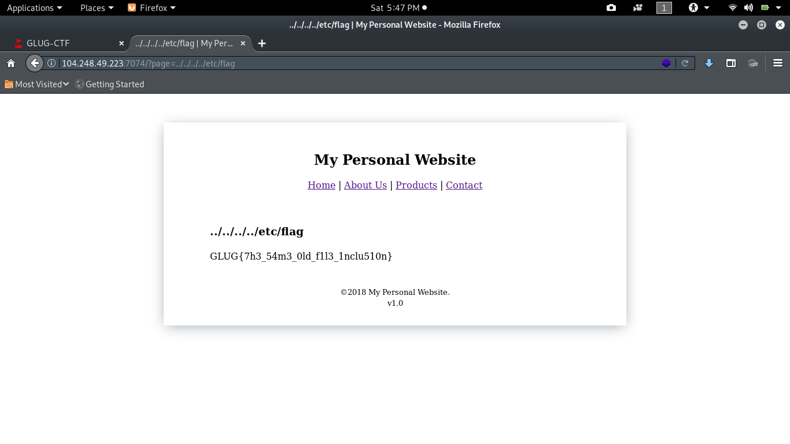

#### NinjaGirl (120 points)

The challenges were pretty easy so far but this one was interesting.

The challenge asks us to submit our name and our opponent’s name.

Also, source code is shared [here](https://ghostbin.com/paste/seah6).

> <?php

> include ‘secret.php’;

> if($\_GET\[“str1”\] and $\_GET\[“str2”\])

> { if ($\_GET\[“str1”\] !== $\_GET\[“str2”\] and

> hash(“md5”, $salt . $\_GET\[“str1”\]) === hash(“md5”, $salt . $\_GET\[“str2”\]))

> { echo $flag; }

> else

> { echo “Sorry, you’re wrong.”; }

> exit(); }

> ?>

The above code asks us to input two strings which shouldn’t be same but their hashes should be same!

Since, there is a strict comparison (!==), the exploitation was tricky.

Looking at code, we can see that there is concatenation with ‘$salt . $\_GET\[“str2\]” ’, which implies that array will be casted as string. It is safe to assume that we can bypass the quality check by passing two arrays instead of strings because of the fact that in PHP when we concatenate a string1 with array1, we get the same string which we would get if we concatenate string1 with array2.

So, testing that out our URL becomes [**http://104.248.49.223:7075/?str1\[\]=xxx&str2\[\]=xxxx**](http://104.248.49.223:7075/?str1[]=x&str2[]=xx) which gives us our flag.

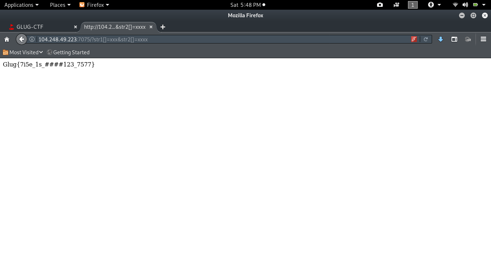

#### The Infinity War (120 points)

Browsing to the website displayed some vote cards of marvel heroes with a search box to enter the name of any superhero to filter the results.

I fuzzed for command injection without any success.

So, next i tried to input ‘ and “ to look for any mysql errors with no luck.

There was nothing else on that page, just some images and this filter search box. So, it was sure that we need to make use of this box.

I was pretty sure it had to do something with the database injection as challenge description said “Loki hid the results” and there was no other place in the website where he could possibly do that.

I started fuzzing again:

> **thor’** = no results

> **thor’or’1'=’1** = all results

> **thor’or’1'=’1 — **\= just thor card

This was surprising and indicated towards an sql injection.

I input thor in search box and intercepted the request, copied the contents and saved it as sql.txt.

Next step was to fire up sqlmap, using command

> **sqlmap -r sql.txt -p valueToSearch — dump**

What this command does is, loads from the http-request file and fuzz the parameter which appears to be vulnerable and dump the contents of database. The flag was hidden in a table named Leaders under the column name IHidItHere.

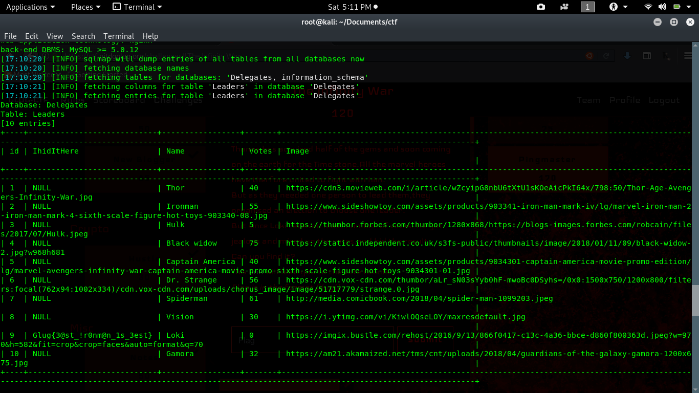

#### Ping Master (170 points)

This one was bit different challenge and taught me few new things. Hint said flag was in /etc/flag.

The website displayed a box with ping button asking us to ping a server.

Input google.com and it worked well.

Tried to input localhost and surprisingly that worked too. This has nothing to do with this challenge but could worth a fortune if you could find that on some bug bounty programs. You can read more about it [**here**](https://www.acunetix.com/blog/articles/server-side-request-forgery-vulnerability/).

As every other pentester would do, i input localhost;cat /etc/flag but got an error message saying “Input contains invalid characters”

This means there are some validations in place.

One preventive measure i noticed was URL encoding of the input symbols. URL became [http://104.248.49.223:7090/?host=localhost%3Bcat+%2Fetc%2Fflag](http://104.248.49.223:7090/?host=localhost%3Bcat+%2Fetc%2Fflag) when i input localhost;cat /etc/flag

Let’s see how we can bypass these validations.

First thing is to try every payload on url itself.

I googled for some bypasses, combined them and formed the following payload :

[http://104.248.49.223:7090/?host=localhost%0acat</etc/flag](http://104.248.49.223:7090/?host=localhost%0acat%3C/etc/flag)

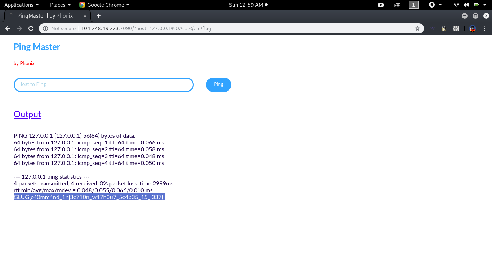

Breaking down the payload, %0a is used for new line and to remove spaces in commands we could use < symbol. The above URL on execution displayed the flag successfully!

I got the bypass cheatsheet from [here!](https://github.com/lucyoa/ctf-wiki/tree/master/web/command-injection)

_That’s it for the web part. Suggestions and improvements are welcomed._

Bug bounty write-ups coming soon! Stay Tuned!

Find me on twitter @[mr\_r0w07](https://twitter.com/Mr_R0w07)
